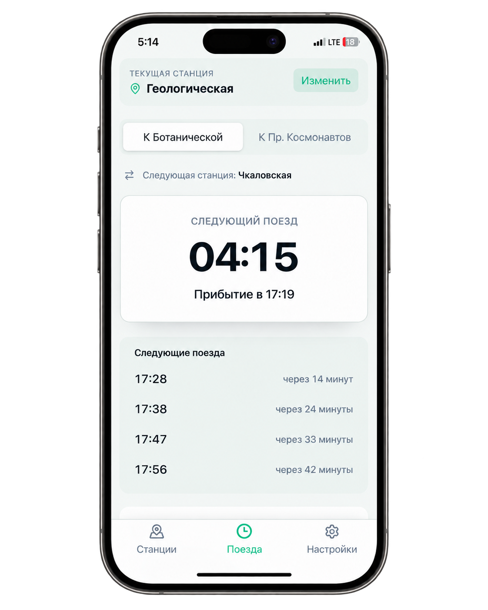
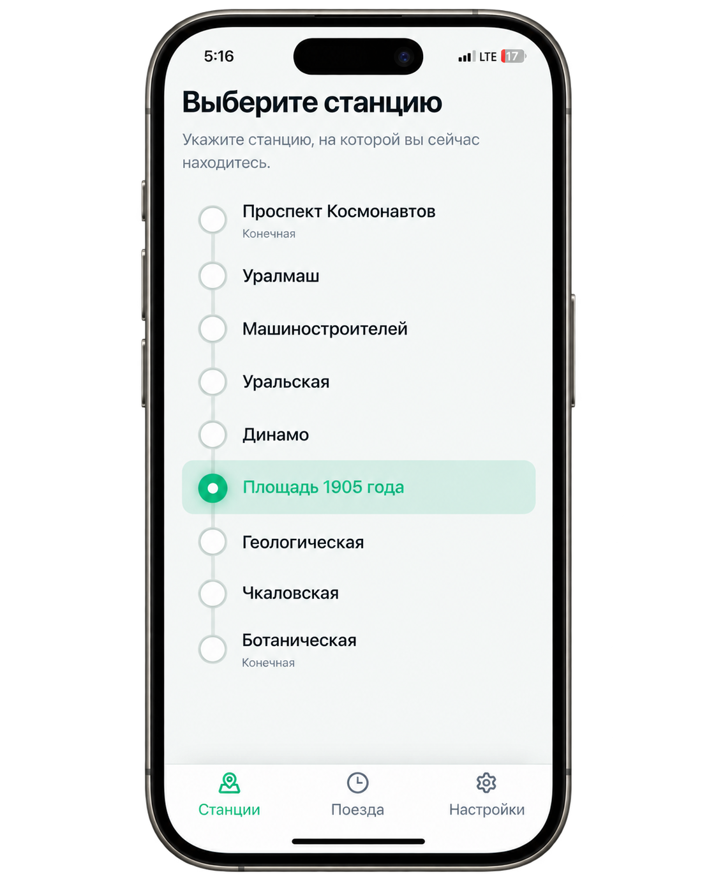
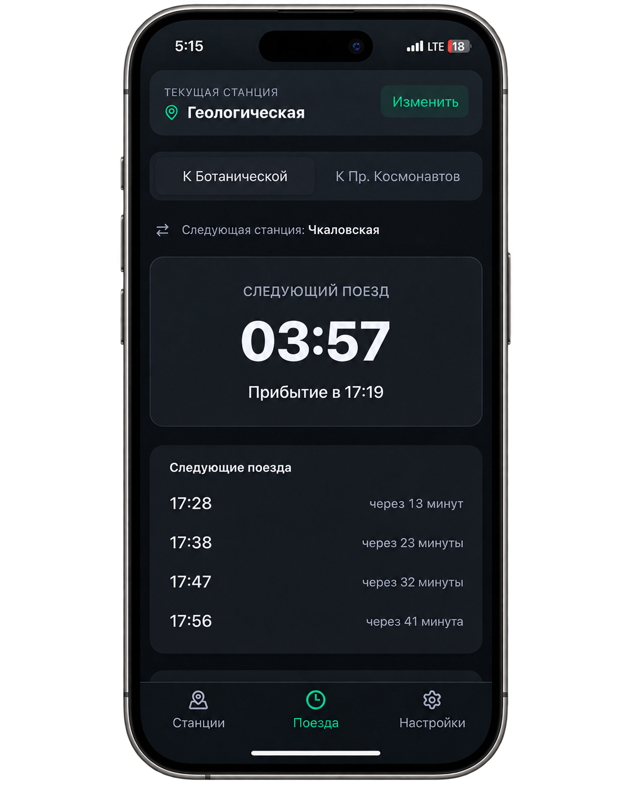

# Metro EKB

Unofficial PWA for the Yekaterinburg Metro: choose a station and direction, view upcoming departures, estimate a trip to another station, and find the train that gets you there by a target arrival time.

## Live Demo

[Open Metro EKB on GitHub Pages](https://yarrobong.github.io/ekb-metro/)

<p align="center">
  
</p>

## Features

- select the current station from an interactive line diagram;
- choose a valid direction and see the next train plus four upcoming departures;
- view first/last train information and the full daily timetable for the selected station;
- calculate station count, travel time, and estimated arrival time;
- plan a trip for a target arrival time, including after-midnight service;
- automatic, light, and dark themes with persisted user preference;
- installable PWA with core screens available offline after the first successful load;
- mobile-first interface with keyboard-friendly controls and visible focus states.

## Tech Stack

- React 19 + TypeScript;
- Vite + Tailwind CSS;
- Zustand for session state and user preferences;
- Zod for validating local timetable data;
- Vitest + React Testing Library for unit/component tests;
- Playwright for end-to-end scenarios;
- `vite-plugin-pwa` for the manifest and service worker;
- GitHub Actions + GitHub Pages for CI/CD and production deployment.

## Engineering Highlights

### Domain layer and page model

Timetable logic, operational-day rules, timezone handling, route calculation, and trip estimates live in `src/domain`. UI components receive prepared data through props and do not duplicate domain algorithms.

`TrainsPage` is responsible for screen composition. Store integration and prepared view data live in `src/pages/trains/useTrainsPageModel.ts`, while independent presentation blocks live in `src/components/metro/trains/`.

### Metro operational day

A calendar date and a metro operational day are not always the same thing. Departures after midnight can logically belong to the previous operating day. The domain service handles this boundary explicitly: the late-night part of the timetable remains at the end of the schedule while the UI still displays normal `00:xx` times instead of artificial values such as `24:xx`.

All calculations use the `Asia/Yekaterinburg` timezone. Pre-opening, post-closing, first/last train, and arrival-planner edge cases are covered by tests.

### Local timetable data

The application is fully client-side. Timetables and segment travel times are bundled from `src/data/*`; there is no runtime API, backend, database, GPS, or realtime train tracking. The `npm run validate:data` script validates stations, directions, schedules, and segment times before production builds.

## Screenshots

<p align="center">
  
  &nbsp;&nbsp;&nbsp;&nbsp;
  
</p>

<p align="center">
  
  &nbsp;&nbsp;&nbsp;&nbsp;
  
</p>

## Architecture

```text
src/
├── app/                  shell, Zustand store, theme and PWA context
├── components/
│   ├── metro/             map, destination sheet and route cards
│   └── metro/trains/      props-driven TrainsPage blocks
├── data/                  local stations, directions and timetable data
├── domain/
│   ├── metro/             timetable, operational day and trip calculations
│   └── time/              timezone-aware time helpers
├── pages/                 application screens
│   └── trains/            TrainsPage model and presentation utilities
└── styles/                Tailwind/CSS tokens and responsive styles
```

## Testing and CI/CD

Local release check:

```bash
npm run format:check
npm run typecheck
npm run lint
npm run validate:data
npm run test:run
npm run test:e2e
npm run build
```

The checks cover time/timetable domain logic, component behavior, routes and destination selection, theme/PWA flows, an offline smoke test, responsive layout, and after-midnight scenarios.

GitHub Actions runs a `verify` job and a separate `playwright` job. GitHub Pages deployment is allowed only after both jobs succeed; pull requests do not deploy.

The current release baseline includes **140 automated unit/integration tests** and **18 Playwright E2E scenarios**.

## PWA and Offline

The production build generates a manifest and service worker through `vite-plugin-pwa` (`generateSW`). The app shell and bundled local data are cached after the first successful load, so the core screens remain available offline. Updates are applied only after explicit user action through the update prompt.

Production base path: `/ekb-metro/`.

## Local Development

The project uses `npm` only:

```bash
npm ci
npm run dev
```

Dev server: `http://localhost:3000`.

For production preview:

```bash
npm run build
npm run preview
```

E2E runs cross-platform through `npm run test:e2e`; Playwright automatically builds the E2E bundle and starts the preview server at `http://127.0.0.1:4173/ekb-metro/`.

## Timetable Source

Canonical application data lives in:

- `src/data/schedule.ts`;
- `src/data/stations.ts`;
- `src/data/directions.ts`;
- `src/data/driveTimes.ts`;
- `src/data/specialDates.ts`;
- `src/data/metadata.ts`.

The data is checked against the [official Yekaterinburg Metro operating schedule](https://metro-ektb.ru/rezhim-raboty-metropolitena-grafik_1211/). Timetable changes should be made only after verifying the source and must be validated with `npm run validate:data`.

## Disclaimer

Metro EKB is an unofficial application and is not affiliated with the Yekaterinburg Metro. Calculations use locally stored timetable data and nominal segment travel times; they do not represent realtime train positions and may differ from actual service.

## Release

Current version: `1.0.0`.

Stable portfolio release: [**Metro EKB v1.0 — Portfolio Release**](https://github.com/yarrobong/ekb-metro/releases/tag/v1.0.0)

## Feedback

[Report a bug through GitHub Issues](https://github.com/yarrobong/ekb-metro/issues)
